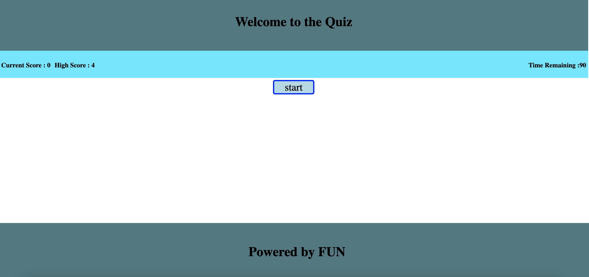

# QuizGame
A fun quiz for javascript. This quiz for for 90 seconds and every wrong answer results into losing 5 seconds. 

# Technologies
HTML, JavaScript, CSS 

[Let's Play](https://ramumakkena.github.io/QuizGame/)

# Sample screens
## Home Page

## Question

## NoOption

## OptionSelected

## WrongAnswer

## RightAnswer

## Save Score

## Previous high scores

